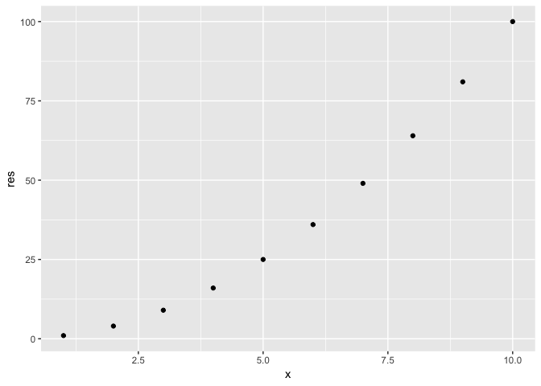
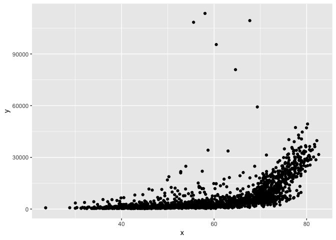

<!-- README.md is generated from README.Rmd. Please edit that file -->
[](https://travis-ci.org/vincenzocoia/powers)

powers
======

This is an R package that gives `square`, `cube`, `reciprocal`, `root_square` and `lm_plot` functions.

Installation
------------

You can install powers from github with:

``` r
# install.packages("devtools")
devtools::install_github("lh563/powers")
```

Example
-------

See the vignette for more extensive use, but here's an example:

``` r
powers::reciprocal(2)
#> [1] 0.5
powers::square(1:10)
```



    #>  [1]   1   4   9  16  25  36  49  64  81 100
    library(gapminder)
    powers::lm_plot(gapminder$lifeExp, gapminder$gdpPercap, mydata = gapminder)
    #> # A tibble: 2 x 5
    #>   term        estimate std.error statistic   p.value
    #>   <chr>          <dbl>     <dbl>     <dbl>     <dbl>
    #> 1 (Intercept)  -19277.     914.      -21.1 6.74e- 88
    #> 2 x               445.      15.0      29.7 3.57e-156



For Developers
--------------

Use the internal `pow` function as the machinery for the front-end functions such as `square`, `cube`, `reciprocal`, `root_square` and `lm_plot`
